Descrever sobre as regiões e grupos de recursos na Azure

Quanto as regiões
A Azure possui diversas regiões, as partes físicas da Azure, onde os recursos estao localizados como por exemplo:
- US
- EU
- ASIA

Temos as regiões soberanas que são exclusivas para um país, como por exemplo:
- US (seus orgãos de governo, militares, federais entre outras)

Todas a regiões possui pares, imaginando um par de regiões, por exemplo: 
- A e B
- C e D

Se um recurso falhar  em A ela tem uma replicação em B, se falhar em C ela tem uma replicação em D e assim por diante, possibilitando uma alta disponibilidade e preparado para Disaster Recovery

Grupo de Recursos
É como uma caixa onde guardamos as coisas para uma organização.
Exemplo:
    Ao criar uma máquina virtual, um banco de dados, um firewall, etc podemos criar um grupo de recursos

Como numa empresa:
- Criamos um grupo de recursos para cada equipe
- Criamos um grupo de recursos para cada departamento
- Criamos um grupo de recursos para cada projeto
- Criamos um grupo de recursos para cada cliente
- Criamos um grupo de recursos para cada região

Não tem certo ou errado, os grupos de recursos devem ser criados de acordo com o que precisa ser organizado em sua empresa

Veja o gráficco mermaid a seguir com 3 grupos de recursos para o departamento de marketing, financeiro e vendas:

```mermaid
graph TD
    Marketing["Marketing"]
    Financeiro["Financeiro"]
    Vendas["Vendas"]

    Marketing --> VM1["VM1"]
    Marketing --> VM2["VM2"]
    Marketing --> VM3["VM3"]
    Marketing --> VM4["VM4"]
    Marketing --> VM5["VM5"]
    Marketing --> VM6["VM6"]
    Marketing --> VM7["VM7"]
    Marketing --> VM8["VM8"]
    Marketing --> VM9["VM9"]
    Marketing --> VM10["VM10"]
    Marketing --> VM11["VM11"]
    Marketing --> VM12["VM12"]
    Marketing --> VM13["VM13"]
    Marketing --> VM14["VM14"]
    Marketing --> VM15["VM15"]
    Marketing --> VM16["VM16"]
    Marketing --> VM17["VM17"]
    Marketing --> VM18["VM18"]
    Marketing --> VM19["VM19"]
    Marketing --> VM20["VM20"]

    Financeiro --> VM21["VM21"]
    Financeiro --> VM22["VM22"]
    Financeiro --> VM23["VM23"]
    Financeiro --> VM24["VM24"]
    Financeiro --> VM25["VM25"]
    Financeiro --> VM26["VM26"]
    Financeiro --> VM27["VM27"]
    Financeiro --> VM28["VM28"]
    Financeiro --> VM29["VM29"]
    Financeiro --> VM30["VM30"]
    Financeiro --> VM31["VM31"]
    Financeiro --> VM32["VM32"]
    Financeiro --> VM33["VM33"]
    Financeiro --> VM34["VM34"]
    Financeiro --> VM35["VM35"]
    Financeiro --> VM36["VM36"]
    Financeiro --> VM37["VM37"]
    Financeiro --> VM38["VM38"]
    Financeiro --> VM39["VM39"]
    Financeiro --> VM40["VM40"]

    Vendas --> VM41["VM41"]
    Vendas --> VM42["VM42"]
    Vendas --> VM43["VM43"]
    Vendas --> VM44["VM44"]
    Vendas --> VM45["VM45"]
    Vendas --> VM46["VM46"]
    Vendas --> VM47["VM47"]
    Vendas --> VM48["VM48"]
    Vendas --> VM49["VM49"]
    Vendas --> VM50["VM50"]
    Vendas --> VM51["VM51"]
    Vendas --> VM52["VM52"]
    Vendas --> VM53["VM53"]
    Vendas --> VM54["VM54"]
    Vendas --> VM55["VM55"]
    Vendas --> VM56["VM56"]
    Vendas --> VM57["VM57"]
    Vendas --> VM58["VM58"]
    Vendas --> VM59["VM59"]
    Vendas --> VM60["VM60"]
```

Assinaturas do Azure
Conta do Azure
  Assinatura 1 - Grupo de Devs 
    Fatura 1
  Assinatura 2 - Projeto X
    Fatura 2
  Assinatura 3 - Grupo de QAs
    Fatura 3

Uma assinatura estará sempre atrelada a uma única conta da Azure e um perfil de cobrança. 
Uma assinatura pode ter vários perfis de cobrança.
Já uma conta da Azure pode ter vários perfis de cobrança e assinaturas.

Assinatura fornece acesso e autenticação para um perfil de cobrança.

Limite de cobrança: Relatorios e dashboards separados para cada assinatura

Limite de controle de acesso: Gerenciar e controlar o acesso aos recursos que os usuarios podem provisionar com assinaturas específicas

Grupos de Gerenciamento
  Terá assinaturas
    Grupos de Recursos
      Recursos

Exemplo 1:
Assinatura 1
  Grupo de gerenciamento
    Grupo de recursos
      VM1
      VM2