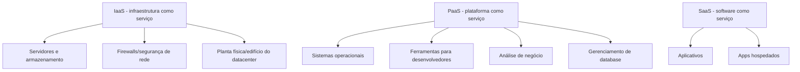

Tipos de Serviços e o que é oferecido de acordo com cada um

IaaS - infraestrutura como service
- Servidores e armazenamento
- Firewalls/segurança de rede
- Planta física/edifício do datacenter

PaaS - plataforma como serviço
- Sistemas operacionais
- Ferramentas para desenvolvedores
- Análise de negócio
- Gerenciamento de database

SaaS - software como serviço
- Aplicativos
- Apps hospedados

